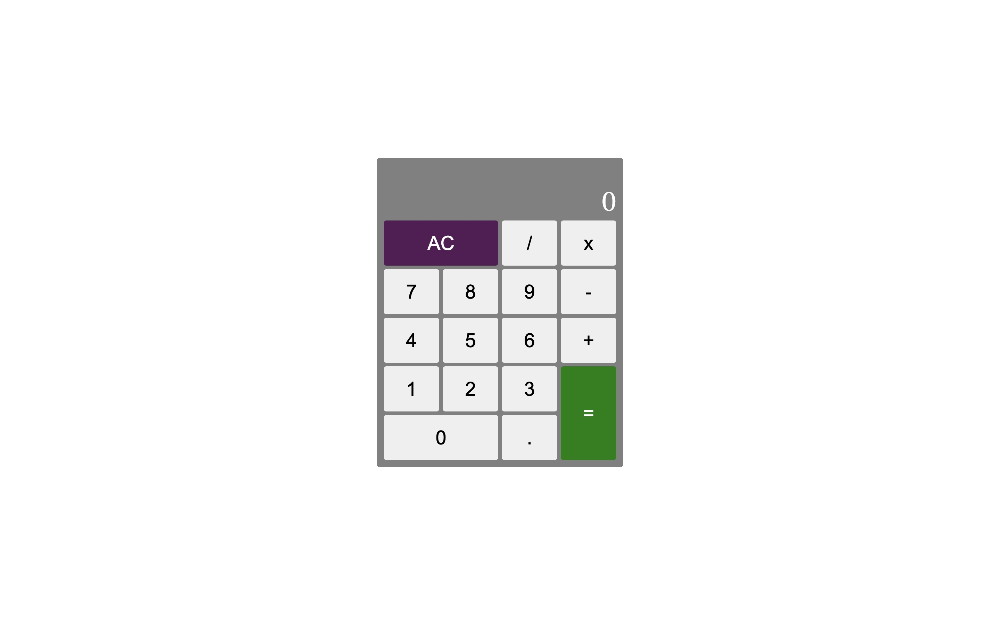

# JS Calculator

An Simple App Calculator.

## Screenshots

## Demo

[Link](https://codepen.io/thepageguy/pen/xxmPKWP)

## Author

- [@thepageguy](https://www.github.com/thepageguy)

## Acknowledgement

- [FreeCodeCamp](https://www.freecodecamp.org/)

## Tech Stack

**Languages:** HTML5, CSS3 and React.js

## Features

- Basic Operations
- Delete Button
- Works with Decimals

## Lessons Learned

- Array of Object Manipulation
- React useState

## Feedback

If you have any feedback, please reach out at thepageguy@mailfence.com.
